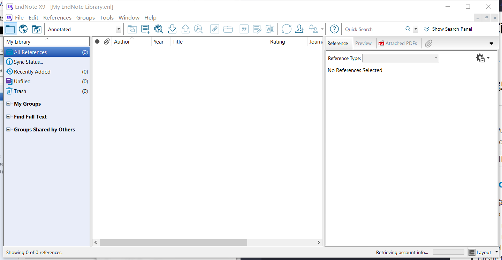

# 文献导入
***
> **使用EndNote X9进行学习**

## 建立文献数据库
主界面 

File **→** New  **→**  选择存储位置进行保存 

## 数据库导入
| 类别 | 实例 |
| ---  | ---- |
| 英文 | Pubmed、Web Of Science、Google Scholar等 |
| 中文 | 知网、万方等 |

### [Pubmed](https://pubmed.ncbi.nlm.nih.gov/)
- 输入关键词检索文献
- send to **citation manager**
  - All results on this pages
  - All result
  - Selection
- Create file
- Create file文件导入方式
  - 直接双击导入
  - 从EndNoteX9中通过文献过滤器（filter）导入
    - file→import→file→选择Create file文件→import option（先选择other option→找到Pubmed选项→import） 

**常见其他数据库的文献过滤器**

| 数据库 | 过滤器 |
| ---  | ---- |
| Pubmed | Pubmed (NLM) |
| Web Of Science | ISI-CE |
| Google Scholar | EndNote generated XML |
| Scopus、ScienceDirect | Reference Manager (RIS) |
| 知网、万方维普等 | EndNote import |

### [Web Of Science](https://www.webofscience.com)
- 输入关键词检索文献
- 导出 **EndNote Desktop**
  - 检索结果导出
  - 所有记录
  - 选择记录范围
  - 记录内容：一般选择带摘要
- 导出
- 文件导入方式
  - 直接双击导入
  - 从EndNoteX9中通过文献过滤器（filter）导入
    - file→import→file→选择Create file文件→import option（先选择other option→找到ISI-CE选项→import） (导入后默认按照作者姓名首字母排序)

### [Google 学术搜索](https://scholar.google.com/)  需要科学上网
- 方法1
  - 输入关键词检索文献
  - 引用
  - **EndNote**
  - 导出
  - 文件导入方式
    - 直接双击导入
    - 从EndNoteX9中通过文献过滤器（filter）导入
      - file→import→file→选择Create file文件→import option（先选择other option→找到EndNote generated XML选项→import） (导入后默认按照作者姓名首字母排序)

- 方法2
  - 输入关键词检索文献
  - 在左上角设置里面→参考数目管理文件→显示导入EndNote的链接
  - **导入EndNote**
  - 导出
  - 文件导入方式
    - 直接双击导入
    - 从EndNoteX9中通过文献过滤器（filter）导入
      - file→import→file→选择Create file文件→import option（先选择other option→找到EndNote generated XML选项→import） (导入后默认按照作者姓名首字母排序)

### [中国知网](https://www.cnki.net/)
- 输入关键词检索文献
- 选择文献
- 导出与分析 **EndNote**
- 导出
- 文件导入方式
  - 从EndNoteX9中通过文献过滤器（filter）导入
    - file→import→file→选择Create file文件→import option（先选择other option→找到EndNote import选项→import） (导入后默认按照作者姓名首字母排序)

### [万方数据](https://www.cnki.net/)与知网类似

### 可能出现的问题与解决方案
!> 中文文献导入之后乱码

?> 此问题原因为txt文件编码问题，在Text Traslation出选择UTF-8即可

!> EndNote X9会存在论文标题和期刊名称混合在一起的问题

?> 解决办法：Edit→import filters→open filter manager→找到EndNote Import→Edit→选择左侧的Templates→上方的Reference Types选择Journal Article→将 **%B Journal** 改成 **%J Journal**改成 保存

!> 文献信息不全 ( 中文需要自己添加 )

?> 解决办法：批量选择文献→鼠标右键Find Reference Updates→左侧为更新信息，右侧为原始文献信息→更新

## PDF导入
PDF的导入原理为识别文献doi号，故中文文献不建议PDF直接导入

### 文件夹导入
File→Import→Import Folder

The End ~
