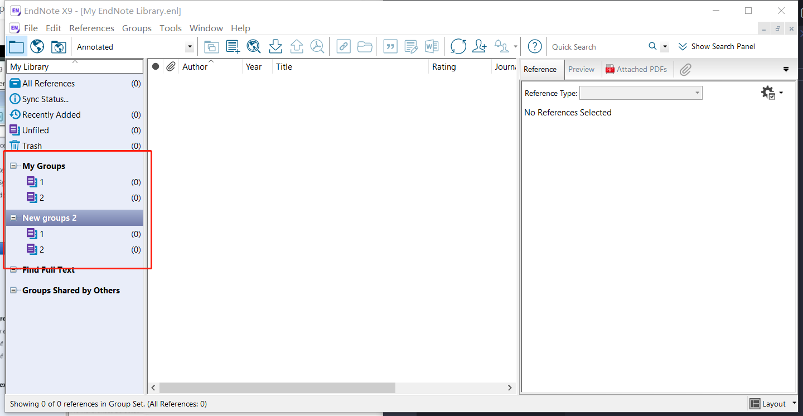

# 管理文献
***
## 分组
EndNote最多支持2级文件目录
创建方法：
- 创建一级文件夹
  - 单击右键 create group set
- 创建二级文件夹
  - 单击右键以及文件夹 create group
  

## 文献去重
- All References
- References
- Find Duplicates 
- Cancel
- 选择灰色背景的文献，单击右键Move References To Trash

## 书籍或专著引用
在参考文献界面，新建参考文献。
- 将Reference Type改为**book**
- 补充书籍和专著信息保存即可

## 属性栏
属性栏的作用主要显示**文献的标题、期刊、年份、作者**等信息。单击右键属性栏可自由选择显示特定的属性标签。

e.g.: 
1. Rating可以通过打星来标记文献的重要程度。
2. Read/Unread Status表示文献是否阅读。

File Attachement (属性栏就会出现一个回形针标记，中文需要手动)
选择文献→右键→Find Full Text

## 对文献做笔记
选择文献
在下方【**可在右下角layout设置为右侧显示**】参考文献信息面板的找Reference
Research notes【可在属性栏调出来】
Ctrl + s保存

The End ~
